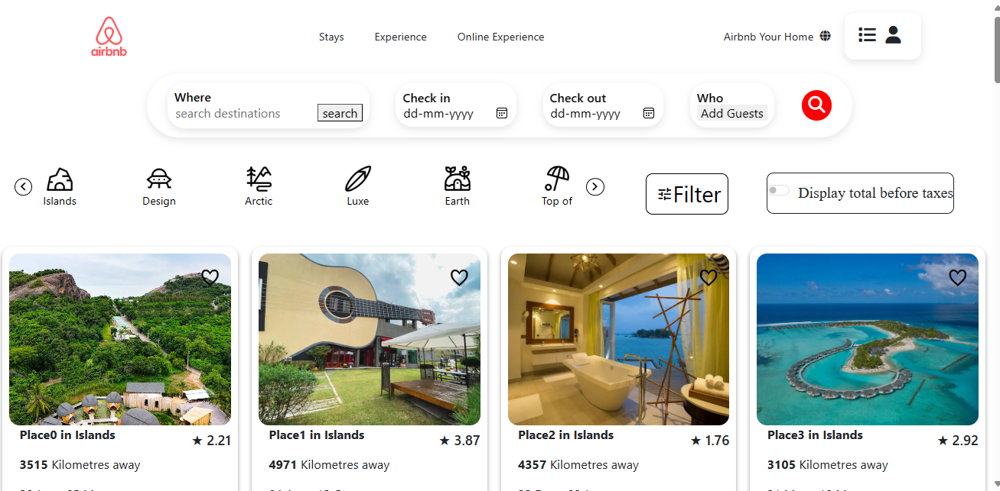

# -Byte-Bhaasha-2345

## Introduction
This project is a clone of the page 
[Airbnb](https://www.airbnb.co.in/?tab_id=home_tab&refinement_paths%5B%5D=%2Fhomes&search_mode=flex_destinations_search&flexible_trip_lengths%5B%5D=one_week&location_search=MIN_MAP_BOUNDS&monthly_start_date=2024-05-01&monthly_length=3&monthly_end_date=2024-08-01&price_filter_input_type=0&channel=EXPLORE&category_tag=Tag%3A675&search_type=filter_change&price_filter_num_nights=5&date_picker_type=calendar&source=structured_search_input_header), which provides the ultimate destination for booking accommodations and exploring new destinations. Whether you're planning a weekend getaway or a long-term stay, Airbnb provides a convenient and user-friendly platform to discover unique stays and unforgettable experiences.

This project aims to recreate the visual layout and Build the functionality of the original website.

## Project Type
Frontend | Backend

## Deployed App
Airbnb: https://660ed2f31f56241d114e76cc--calm-bombolone-94435e.netlify.app/

## Team Members:-
1- M Baba khalil (ft30_400)

2- Adithya Sudev (ft30_401)

3- Rakesh (ft30_143)

4- Onkar (ft30_312)

5- Manas Mishra (ft30_164)

## Directory Structure


## Video Walkthrough of the project
video walkthrough project:-https://drive.google.com/file/d/1_IWCxphXtcqtUIbKcEEpuZsk3CbjCu_o/view?usp=sharing

## Features
Features 

- Sign Up and Sign In: Easily create an Airbnb account or sign in to access the full range of features and book your dream accommodation.

- Accommodation Booking: Browse through a diverse selection of accommodations, including homes, apartments, villas, and more, and book your ideal stay with ease.

- Infinite Scrolling: Enjoy seamless browsing with infinite scrolling, allowing you to explore numerous accommodation options without navigating multiple pages.

- Advanced Filters: Narrow down your search results with advanced filtering options based on price, location, amenities, and more, to find the perfect place to stay.

## design decisions or assumptions

Airbnb addresses common challenges faced by travelers when booking accommodations, including:

- Time-consuming search processes: Our platform streamlines the search process with advanced filters and infinite scrolling, saving users time and effort.

- Limited accommodation options: Airbnb offers a vast selection of unique stays, ensuring that travelers can find accommodations that suit their preferences and budget.

- Lack of authentic travel experiences: By connecting guests with local hosts and offering a wide range of experiences, Airbnb enables travelers to immerse themselves in the culture and community of their destination.

## Installation & Getting started
## bootstrap :

1)  Go to Terminal <br> 
   Enter the commands : <br>
   cd path/to/your/project <br>
   npm init -y <br>
   npm install bootstrap <br>
               <br>  OR   <br> <br> 
  Copy and paste the link in the head of the HTML code:
    <link href="https://cdn.jsdelivr.net/npm/bootstrap@5.3.3/dist/css/bootstrap.min.css" rel="stylesheet" integrity="sha384-QWTKZyjpPEjISv5WaRU9OFeRpok6YctnYmDr5pNlyT2bRjXh0JMhjY6hW+ALEwIH" crossorigin="anonymous">
    <script src="https://cdn.jsdelivr.net/npm/bootstrap@5.3.3/dist/js/bootstrap.bundle.min.js" integrity="sha384-YvpcrYf0tY3lHB60NNkmXc5s9fDVZLESaAA55NDzOxhy9GkcIdslK1eN7N6jIeHz" crossorigin="anonymous"></script>    
    
2) Clone the repo in your terminal, and run the command :
   
 git clone git@github.com:ritwikdutta2k/CW-Project-1.git


Detailed instructions on how to install, configure, and get the project running. For BE/FS projects, guide the reviewer how to check mongodb schema etc.

```bash
npm install my-project
cd my-project
npm start
```

## Usage
clone from the repository (By using the git clone URL) and open with the live server.




## Credentials
Provide user credentials for autheticated pages

## APIs Used
If your application relies on external APIs, document them and include any necessary links or references.

Follow these steps to set up a JSON server for your project:

1. **Initialize npm**: Start by initializing a new npm project in your project directory:  npm init -y
 
2. **Install JSON Server**: Install JSON Server as a dependency in your project: npm install json-server
  

3. **Prepare Data File**: Create a JSON file to serve as your database. Make sure the file has a `.json` extension and contains your data in JSON format.

4. **Create Server Script**: Create a `server.js` file to define your JSON Server configuration and routes.

5. **Create .gitignore**: Create a `.gitignore` file and add `node_modules` to it to exclude the `node_modules` directory from version control.

6. **Define Start Script**: In your `package.json` file, add a `start` script to start the JSON Server:
``json
"scripts": {
  "start": "node server.js"
}

7. Add to Repository: Add your project files to your Git repository: git add .
8. Commit Changes: Commit your changes to Git: git commit -m "msg"
9. Push to Remote Repository: Push your changes to your remote Git repository: git push origin main
10. Use JSON Server: You can use JSON Server to serve your data by running the following command: npm start.

Create Webservice Option: If you want to host your JSON Server online, you can paste the GitHub code link in the appropriate option to generate a JSON server on your account.

That's it! You've now set up a JSON server for your project. You can access your JSON server by visiting http://localhost:3000.

In this project, we have used Render to create JSON server online.

## API Endpoints

Data Servers: - https://airbnbproject-id6p.onrender.com 
              - https://airbin-data-8.onrender.com/data

In case of Backend Applications provide a list of your API endpoints, methods, brief descriptions, and examples of request/response.
GET /api/items - retrieve all items
POST /api/items - create a new item


## Technology Stack
List and provide a brief overview of the technologies used in the project.

- Java Script
- HTML
- CSS
- Bootstrap
- Other libraries/modules

## Important
1- Our main branch is 'main'. But you have to push the code to your branch. So Push code accordingly.

2- Notion doc for all references https://masai-school.notion.site/MSI-CW-Block-33-064ef60239a34a76ad8ca8ba4ed58eba

3- Use Kanban to update issues and to-do lists.

4- Check tasks after completing the task.

## Most importantly
# In case of fire
# 1- git add.
# 2. git commit -m "your message"
# 3. git push origin main

